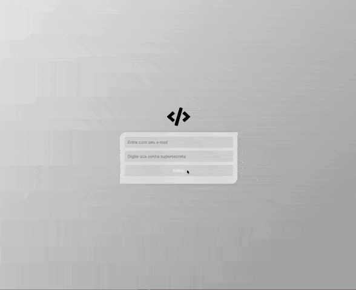

# Sample Login

Este é um desafio técnico para Desenvolvedor Frontend.

- Restaura partes do código
- adiciona requisições assíncronas
- aplica layout
- consume api `http://www.mocky.io/v2/5dba690e3000008c00028eb6`
- fake token gerado
- sessão deve durar 5 min
- e-mail válido html5
- testar partes sensiveis

## Tecnologias utilizadas

HTML5, JavaScript e CSS. Simples assim. Sem libs, sem frameworks, sem dependências externas.
Você não deve usar nenhum CSS Framework (Bootstrap, PureCss, etc.);

## Entrega

[http://hideiki-sample-login.herokuapp.com/](http://hideiki-sample-login.herokuapp.com/)

## Preview

